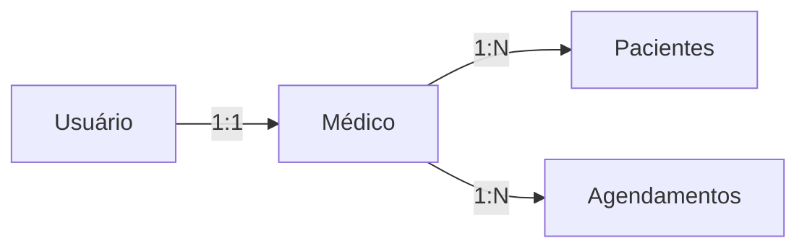

# 🏥 Sistema de Agendamento Médico


Sistema completo para gestão de consultas médicas com autenticação, CRUD de pacientes, médicos e agendamentos.

## 📦 Estrutura do Projeto

```
agendamento-app/
├── app/
│   ├── Models/
│   │   ├── Agendamento.php
│   │   ├── Medico.php
│   │   └── Paciente.php
│   └── Http/
│       ├── Controllers/
│       │   ├── AgendamentoController.php
│       │   ├── MedicoController.php
│       │   └── PacienteController.php
├── docker/
│   ├── Dockerfile
│   └── nginx.conf
├── database/
│   └── migrations/
│       ├── create_medicos_table.php
│       ├── create_pacientes_table.php
│       └── create_agendamentos_table.php
├── routes/
│   └── web.php
└── docker-compose.yml
```

## 🚀 Recursos Principais

- **Autenticação Segura**
  - Login/Cadastro de médicos
  - Middleware de proteção nas rotas

- **Gestão Completa**
  - CRUD de Pacientes
  - CRUD de Médicos
  - Agendamento de Consultas

- **Relacionamentos**
  - Médico → Agendamentos (1:N)
  - Paciente → Agendamentos (1:N)
  - User → Médico (1:1)

## 🛠 Tecnologias Utilizadas

| Componente       | Tecnologia           |
|------------------|----------------------|
| Backend          | Laravel 8.2          |
| Frontend         | Blade Templates      |
| Banco de Dados   | MySQL 8.0            |
| Containerização  | Docker + Nginx       |
| Autenticação     | Session Auth         |

## 🐳 Instalação com Docker

1. **Pré-requisitos**
   ```bash
   Docker >= 20.10
   Docker Compose >= 1.29
   ```

2. **Configuração Inicial**
   ```bash
   git clone https://github.com/Ofrans/Agendamento-de-Pacientes.git
   cd agendamento-app
   cp .env.example .env
   ```

3. **Subir os Containers**
   ```bash
   docker-compose up -d --build
   ```

4. **Instalar Dependências**
   ```bash
   docker-compose exec app composer install
   ```

5. **Configurar Banco de Dados**
   ```bash
   docker-compose exec app php artisan migrate --seed
   ```

6. **Acessar a Aplicação**
   ```
   http://localhost:8000
   ```

## 🔐 Rotas de Autenticação

| Método | Rota       | Descrição               |
|--------|------------|-------------------------|
| GET    | /login     | Formulário de login     |
| POST   | /login     | Processa login          |
| GET    | /cadastro  | Formulário de cadastro  |
| POST   | /cadastro  | Processa cadastro       |
| POST   | /logout    | Encerra sessão          |

# 🏥 Sistema de Agendamento Médico

[... mantidas todas as seções anteriores ...]

## 🛣 Demais Rotas Protegidas

Todas estas rotas exigem autenticação (`auth` middleware):

| Método | Rota               | Controller@Método          | Descrição                              |
|--------|--------------------|----------------------------|----------------------------------------|
| GET    | /pacientes         | PacienteController@index   | Lista pacientes do médico logado       |
| POST   | /pacientes         | PacienteController@store   | Cria novo paciente                     |
| GET    | /pacientes/create  | PacienteController@create  | Formulário de criação                  |
| GET    | /pacientes/{id}    | PacienteController@show    | Detalhes do paciente                   |
| PUT    | /pacientes/{id}    | PacienteController@update  | Atualiza paciente                      |
| DELETE | /pacientes/{id}    | PacienteController@destroy | Remove paciente                        |
| GET    | /pacientes/{id}/edit | PacienteController@edit   | Formulário de edição                   |
| GET    | /medicos           | MedicoController@index     | Lista médicos (apenas do usuário)      |
| POST   | /medicos           | MedicoController@store     | Cria novo médico                       |
| GET    | /medicos/create    | MedicoController@create    | Formulário de criação                  |
| GET    | /medicos/{id}      | MedicoController@show      | Detalhes do médico                     |
| PUT    | /medicos/{id}      | MedicoController@update    | Atualiza médico                        |
| DELETE | /medicos/{id}      | MedicoController@destroy   | Remove médico                          |
| GET    | /medicos/{id}/edit | MedicoController@edit      | Formulário de edição                   |
| GET    | /agendamentos      | AgendamentoController@index | Lista agendamentos do médico          |
| POST   | /agendamentos      | AgendamentoController@store | Cria novo agendamento                 |
| GET    | /agendamentos/create | AgendamentoController@create | Formulário de criação                |
| GET    | /agendamentos/{id} | AgendamentoController@show  | Detalhes do agendamento               |
| PUT    | /agendamentos/{id} | AgendamentoController@update | Atualiza agendamento                 |
| DELETE | /agendamentos/{id} | AgendamentoController@destroy | Remove agendamento                   |
| GET    | /agendamentos/{id}/edit | AgendamentoController@edit | Formulário de edição                |
| POST   | /logout            | AuthController@logout       | Encerra sessão                        |
| GET    | /editar            | UserController@edit         | Formulário de edição de perfil        |
| POST   | /editar            | UserController@update       | Atualiza dados do usuário             |

### 🔒 Regras de Acesso
- Todas as rotas estão protegidas por `auth` middleware
- Filtros automáticos por `medico_id` (quando aplicável)

## 📌 Variáveis de Ambiente Críticas

```ini
DB_CONNECTION=mysql
DB_HOST=mysql
DB_PORT=3306
DB_DATABASE=db_irroba
DB_USERNAME=root
DB_PASSWORD=root

SESSION_DRIVER=database
SESSION_LIFETIME=120
```

## 💡 Boas Práticas Implementadas

1. **Segurança**
   - Validação em todos os endpoints
   - Proteção contra Mass Assignment
   - Logs detalhados de erros

2. **Otimizações**
   - Eager Loading nas relações
   - Transações em operações críticas
   - Indexação de chaves estrangeiras

3. **Organização**
   - Separação clara de responsabilidades
   - Convenções RESTful
   - Tratamento centralizado de exceções

## ℹ️ Informações Importantes

### 1. Fluxo de Acesso
- **Acesso restrito**: Somente usuários cadastrados podem acessar o sistema
- **Redirecionamento pós-login**:
  ```mermaid
  graph TD
    A[Login] --> B{Tem médico vinculado?}
    B -->|Sim| C[Tela de Agendamentos]
    B -->|Não| D[Tela de Cadastro de Médico]
  ```

### 2. Regras de Negócio
- **Cadastro médico obrigatório**:
  - Usuário sem médico vinculado é redirecionado para cadastro médico
  - Bloqueio de acesso à tela de pacientes sem médico cadastrado

- **Escopo de visualização**:
  - Pacientes: Apenas os vinculados ao médico logado
  - Agendamentos: Exclusivamente os do médico autenticado

### 3. Hierarquia de Acesso


### 4. Fluxo Completo
1. Login → Verifica vínculo médico
2. Sem médico → Força cadastro
3. Com médico válido → Mostra:
   - Seus pacientes
   - Seus agendamentos
   - Seu perfil médico

### Destaques incluídos:
1. **Diagramas explicativos**:
   - Fluxo de redirecionamento pós-login
   - Hierarquia de relacionamentos

2. **Regras mapeadas**:
   - Bloqueio de telas sem médico vinculado
   - Filtragem automática por médico logado

3. **Organização visual**:
   - Tópicos numerados
   - Destaque para pontos críticos

## 🧪 Testando o Sistema

```bash
# Executar programa
docker-compose exec app php artisan serve

# Popular banco com dados fake
docker-compose exec app php artisan db:seed
```
